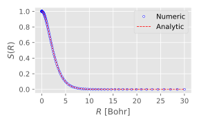
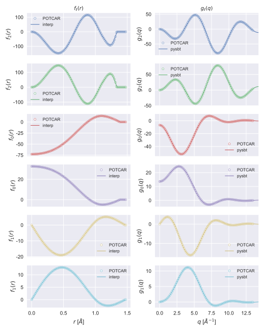

# *py*SBT


A python implementation of spherical Bessel transform (SBT) in O(Nlog(N)) time based on the algorithm proposed by J. Talman.


> "NumSBT: A subroutine for calculating spherical Bessel transforms numerically",
> [Talman, *J. Computer Physics Communications*, 2009, 180, 332-338.](https://www.sciencedirect.com/science/article/pii/S0010465508003329)

For a function f(r) defined on the *logarithmic* radial grid, the spherical Bessel transform f(r) -> g(k) and the inverse-SBT (iSBT) g(k) -> f(r) are give by

 

## Installation

To install pySBT using pip run:

```bash
pip install https://github.com/QijingZheng/pySBT
```

## Examples

- The example shows the the SBT of an exponential decaying function f(r).

  
  
  ```python
  #!/usr/bin/env python
  
  import numpy as np
  from pysbt import sbt
  
  N    = 256
  rmin = 2.0 / 1024 / 32
  rmax = 30
  rr   = np.logspace(np.log10(rmin), np.log10(rmax), N, endpoint=True)
  beta = 2
  f1   = 0.5*beta**3 *np.exp(-beta*rr)
  
  ss = sbt(rr)                                        # init SBT
  g1 = ss.run(f1, direction=1, norm=False)            # SBT
  ```
  
  

  The full code can be found in [examples/ex1.py](examples/ex1.py).

  One can also show that SBT by direct numerical integration deviates from the
  correct result at large k.

  ```python
  ss = sbt(rr)                                        # init SBT
  g1 = ss.run_int(f1, direction=1, norm=False)        # SBT by numerical integration
  ```

  

- Overlap integral of atomic orbitals.  Suppose \psi_{lm}(r) is a atomic orbital
  composed of radial part R_{l,m}(r) and angular part Y_{lm}(\theta, \phi), then
  the overlap integral of two atomic orbitals can be written as

  

  where G is the Gaunt coefficients and g_{l1} and g_{l2} are the SBT of the two
  atomic orbitals, respectively. The above formula shows that the overlap
  integral can be obtained by inverse-SBT of g_{l1} * g_{l2}. For hydrogen 1s
  orbital

  

  The overlap integral can be obtained analytically

  

  See
  [doc/overlap_integral.pdf](doc/overlap_integral.pdf)
  or
  [this post](https://qijingzheng.github.io/posts/Overlap-Integral-in-Momentum-Space/)
  for details.

  ```python
  #!/usr/bin/env python
  
  import numpy as np
  from pysbt import sbt
  from pysbt import GauntTable
  
  N    = 256
  rmin = 2.0 / 1024 / 32
  rmax = 30
  rr   = np.logspace(np.log10(rmin), np.log10(rmax), N, endpoint=True)
  f1   = 2*np.exp(-rr)                                # R_{10}(r)
  Y10  = 1 / 2 / np.sqrt(np.pi)
  
  ss = sbt(rr)                                        # init SBT
  g1 = ss.run(f1, direction=1, norm=True)             # SBT
  s1 = ss.run(g1 * g1, direction=-1, norm=False)      # iSBT
  
  sR = 4*np.pi * GauntTable(0, 0, 0, 0, 0, 0) * Y10 * s1
  
  import matplotlib.pyplot as plt
  plt.style.use('ggplot')
  
  fig = plt.figure(
    dpi=300,
    figsize=(4, 2.5),
  )
  
  ax = plt.subplot()
  
  ax.plot(rr, sR, ls='none', color='b',
          marker='o', ms=3, mew=0.5, mfc='w',
          label='Numeric')
  ax.plot(rr, np.exp(-rr) * (1 + rr + rr**2 / 3),
          color='r', lw=0.8, ls='--', label='Analytic')
  
  ax.legend(loc='upper right')
  
  ax.set_xlabel('$R$ [Bohr]', labelpad=5)
  ax.set_ylabel('$S(R)$', labelpad=5)
  
  plt.tight_layout()
  plt.savefig('s10.svg')
  plt.show()
  ```
  
  
- As is well know, VASP POTCAR contains the information of the projector
  functions of the PAW method, both in real and reciprocal space. The example
  below first interpolates the real-space projector functions on a *logarithmic*
  radial grid and then performs SBT on the resulting real-space projector
  functions, finally compares the results with the reciprocal-space projector
  functions stored in POTCAR. 

  > Note that when performing SBT on real-space projectors, VASP multiplies a
  > prefactor of 4pi.

  Refer to 
  [this post](https://qijingzheng.github.io/posts/VASP-All-Electron-WFC/)
  for more details of VASP PAW projector functions and an example of VASP
  all-electron wavefunction construction.

  ```python
  #!/usr/bin/env python
  
  import numpy as np
  from paw import pawpotcar
  
  from pysbt import sbt
  
  mo_pot = pawpotcar(potfile='mo.pot')
  nproj_l = mo_pot.proj_l.size
  
  N    = 512
  rmin = 2.0 / 1024 / 32
  rmax = mo_pot.proj_rgrid[-1]
  rr   = np.logspace(np.log10(rmin), np.log10(rmax), N, endpoint=True)
  f1   = [mo_pot.spl_rproj[ii](rr) for ii in range(nproj_l)]
  
  ss = sbt(rr)
  g1 = [
      4*np.pi*ss.run(f1[ii], l=mo_pot.proj_l[ii]) for ii in range(nproj_l)
  ]
  
  import matplotlib as mpl
  mpl.rcParams['axes.unicode_minus'] = False
  import matplotlib.pyplot as plt
  plt.style.use('ggplot')
  
  prop_cycle = plt.rcParams['axes.prop_cycle']
  cc         = prop_cycle.by_key()['color']
  
  
  fig, axes = plt.subplots(
      nrows=nproj_l, ncols=2,
      dpi=300,
      figsize=(7.2, 6.4)
  )
  
  for ii in range(nproj_l):
      axes[ii,0].plot(
          mo_pot.proj_rgrid, mo_pot.rprojs[ii],
          ls='none', marker='o', mew=0.5, mfc='w', ms=4, color=cc[ii], 
          label='vasp')
      axes[ii,0].plot(rr, f1[ii], ls='-', lw=1.0, color=cc[ii],
          label=f'interp')
          # label=f'$\ell = {mo_pot.proj_l[ii]}$')
  
      # axes[ii,0].set_ylabel(f'$f_{mo_pot.proj_l[ii]}(r)$')
      axes[ii,0].legend(loc='upper right', fontsize='small')
  
      axes[ii,1].plot(
          mo_pot.proj_qgrid, mo_pot.qprojs[ii],
          ls='none', marker='o', mew=0.5, mfc='w', ms=4, color=cc[ii],
          label='vasp')
      axes[ii,1].plot(ss.kk, g1[ii], ls='-', lw=1.0, color=cc[ii],
          label=f'pysbt')
          # label=f'$\ell = {mo_pot.proj_l[ii]}$')
  
      axes[ii,1].legend(loc='upper right', fontsize='small')
  
      axes[ii,1].set_xlim(-0.05 * mo_pot.proj_gmax, 1.05 * mo_pot.proj_gmax)
  
      if ii < nproj_l - 1:
          axes[ii,0].set_xticklabels([])
          axes[ii,1].set_xticklabels([])
  
      for ax in axes[ii]:
          ax.text(0.05, 0.90, f'$\ell = {mo_pot.proj_l[ii]}$',
                  ha="left",
                  va="top",
                  fontsize='small',
                  # family='monospace',
                  # fontweight='bold'
                  transform=ax.transAxes,
                  bbox=dict(boxstyle='round', facecolor='white', alpha=0.4)
          )
          
  
  axes[-1, 0].set_xlabel(r'$r$ [$\AA$]', labelpad=5)
  axes[-1, 1].set_xlabel(r'$q$ [$\AA^{-1}$]', labelpad=5)
  
  axes[0, 0].set_title(r'$f_\ell(r)$', fontsize='medium')
  axes[0, 1].set_title(r'$g_\ell(q)$', fontsize='medium')
  
  plt.tight_layout()
  plt.savefig('vasp.svg')
  # plt.show()
  ```

  The resulting figure is shown below, where the left panels show the real-space
  projector functions whereas the right panels show the reciprocal-space ones.
  The circles are the original data from POTCAR while the solid lines are either
  from interpolation of the original data (left panels) or SBT results (right
  panels).
  
  
